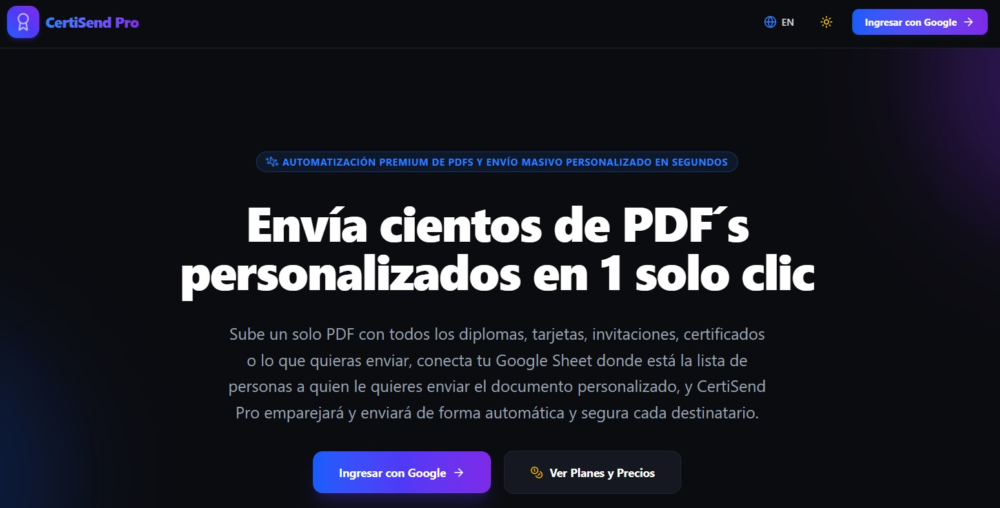

# CertiSendPro 🚀

**CertiSendPro** envía certificados personalizados desde tu propio Gmail. Subes un solo PDF con todos los diplomas, conectas la Google Sheet con tu lista, la IA lee el nombre de cada página y tú revisas cada certificado con su destinatario antes de que salga.

Lo construí porque vi un envío que se hacía a mano: un PDF con todos los diplomas que había que separar y mandar uno por uno. Eso no debería tomarte una tarde.

Pruébalo en [certisendpro.online](https://certisendpro.online/).

## 🆕 Novedades (octubre 2026): ¿qué cambió?

Lo grande: ya no envías a ciegas. Antes de que salga un solo correo, ves qué página va a qué persona y lo confirmas tú.

* **Gratis, hasta 15 certificados por lote.**
* **Emparejamiento uno a uno, con homónimos detectados.** Cada certificado aparece con el nombre que leyó la IA y con el nombre y el correo de su destinatario. Si en tu hoja hay dos personas con el mismo nombre, eliges la fila correcta; la app no toma la primera por ti.
* **Confirmas página → correo antes de enviar.** Revisas la lista completa y la apruebas. Sin esa confirmación, no sale nada.
* **Una huella por certificado, sin guardar correos en claro.** Queda la prueba de cada par página → correo que confirmaste, pero tu lista de destinatarios no se guarda en una base de datos (los registros técnicos pueden conservar 30 días un correo que falló; ver [Privacidad](https://certisendpro.online/privacidad)).
* **En nuestro servidor, tus PDF se borran solos a más tardar en unas 2 horas y 10 minutos.**
* **Autorización de datos y Términos antes de entrar.** Las reglas quedan claras desde el principio: [Términos](https://certisendpro.online/terminos) y [Privacidad](https://certisendpro.online/privacidad).
* **Paquete de 150 envíos.** US$15, que se cobran en pesos a la TRM del día (la web te muestra el valor en COP de hoy). Pago único, válido 1 mes o hasta gastarlo. Los lotes de 15 o menos no gastan el Paquete y los envíos que fallan no se descuentan. El pago en línea llega pronto; mientras tanto, escríbeme a contacto@leonardoantolinez.com.
* **Acuse de cada compra por correo.** Cuando se abra el pago en línea, cada compra recibe su acuse; si ese correo falla, se reintenta solo de forma programada.
* **Plan Pro: próximamente.**

## 📱 Vista Previa de la Aplicación



## 🛠️ Tecnologías Utilizadas

El proyecto fue desarrollado utilizando el siguiente ecosistema técnico:

* **Frontend:** React con TypeScript, estructurado con Vite.
* **Inteligencia Artificial:** Gemini (Google), llamado desde el servidor, para leer el nombre en cada página.
* **Backend:** servidor Node con Express en Cloud Run, Firestore para cuentas y planes, y Firebase Authentication.
* **Hosting:** Firebase Hosting.
* **Pagos:** Mercado Pago, en pesos colombianos (apagado mientras se abre el pago en línea).

## ✨ Características Principales

* **Ingreso con Google:** entras con tu cuenta a través de Firebase Auth.
* **Envío desde tu Gmail:** el correo sale con la API oficial de Gmail, desde tu propia cuenta y con tu dirección.
* **Un PDF, muchos certificados:** subes el archivo completo y la app lo divide en un PDF por persona.
* **Lectura de nombres con IA:** la IA puede equivocarse, por eso cada pareja certificado-destinatario pasa por tu revisión antes de enviar.
* **Asunto y cuerpo del correo personalizados** en todos los planes.

## 🚀 Instalación y Configuración Local

Si deseas ejecutar este proyecto en tu entorno de desarrollo local, sigue estos pasos:

### 1. Clonar el repositorio

```bash
git clone git@github.com:LeonardoIAConsult/CertiSendPro.git
cd CertiSendPro
```

### 2. Instalar dependencias

```bash
npm install
```

### 3. Configurar variables de entorno

Crea un archivo `.env` en la raíz con esta sola línea (no copies `.env.example` entero: trae valores de producción como `NODE_ENV="production"` y `ALLOWED_ORIGINS`, y con ellos la app no abre en local):

```env
GEMINI_API_KEY=tu_api_key_de_gemini
```

Con eso abre la app en http://localhost:3000 y puedes probarla en Modo Invitado (envío simulado). Para enviar correos reales necesitas además `HUELLA_LOTE_SECRET` y credenciales de Google Cloud con acceso a Firestore; cada variable está explicada en `.env.example`.

Nunca subas tu `.env` al repositorio.

### 4. Ejecutar el servidor de desarrollo

```bash
npm run dev
```

---

Desarrollado con ❤️ por Leonardo Antolínez ([LeonardoIAConsult](https://github.com/LeonardoIAConsult)) · actualizado el 6 de octubre de 2026 · contacto@leonardoantolinez.com
